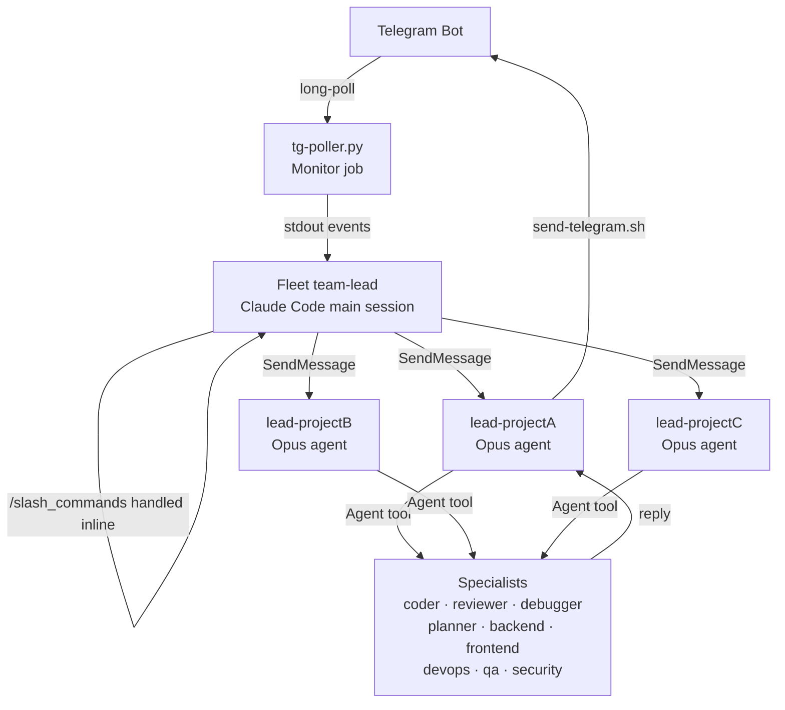

<div align="center">

# The Next Level Claude

### Personal multi-agent Claude Code fleet — Telegram-driven, dispatcher-orchestrated

[](https://opensource.org/licenses/MIT)
[](https://github.com/ndthien98/the-next-level-claude/stargazers)
[](https://github.com/ndthien98/the-next-level-claude/network/members)
[](https://github.com/ndthien98/the-next-level-claude/graphs/contributors)
[](https://github.com/ndthien98/the-next-level-claude/commits/main)
[](https://github.com/ndthien98/the-next-level-claude/issues)

</div>

---

## Table of Contents

- [What is The Next Level Claude?](#what-is-the-next-level-claude)
- [Why?](#why)
- [Prerequisites](#prerequisites)
- [Quick Start](#quick-start)
- [Architecture](#architecture)
- [Concepts](#concepts)
- [Adding a Project](#adding-a-project)
- [Personas](#personas)
- [Customizing](#customizing)
- [Extending the Fleet — Skills, Agents, MCP Servers, Slash Commands](#extending-the-fleet--skills-agents-mcp-servers-slash-commands)
- [Hard Rules](#hard-rules)
- [Restoring After Restart](#restoring-after-restart)
- [Troubleshooting](#troubleshooting)
- [Directory Layout](#directory-layout)
- [Roadmap](#roadmap)
- [Contributing](#contributing)
- [License](#license)
- [Credits](#credits)

---

## What is The Next Level Claude?

The Next Level Claude is a reusable boilerplate for running a personal **multi-project AI agent fleet** inside Claude Code. A single Claude Code session acts as a **fleet dispatcher**: it listens to a Telegram bot, routes each message to the right project lead, and lets each lead spawn ephemeral specialists (coder, reviewer, debugger, planner, backend, frontend, qa, security…) on demand.

Clone the repo, run one setup script, and in under five minutes you have a Telegram-driven coding assistant that covers all your active projects simultaneously — without any project losing context when you switch focus.

---

## Why?

- **Multiple projects, no context collision.** Each project runs under its own persistent Opus lead agent. Switching focus via Telegram doesn't wipe what the other leads know.
- **Phone-first workflow.** Send a message from anywhere → a specialist agent picks it up, works, and replies to your Telegram chat. No laptop required for delegation.
- **Parallel specialists on demand.** The lead dispatches planner, coder, reviewer, debugger, backend, frontend, blockchain, devops, qa, or security agents in parallel, with non-overlapping file ownership to avoid race conditions.
- **Hard safety rails by default.** No auto-commit, no auto-push, no AI attribution in artifacts — every persistent action requires your explicit approval.
- **One restart procedure.** All background jobs (Telegram poller, stall watchdog, daily audit) live inside the Claude Code session. One command re-arms everything after a reboot.

---

## Prerequisites

| Dependency | Notes |
|---|---|
| **Claude Code CLI** | `npm install -g @anthropic-ai/claude-code` |
| **Python 3.10+** | for the Telegram long-poll daemon |
| **jq** | `apt install jq` / `brew install jq` |
| **curl** | for Telegram API calls (usually preinstalled) |
| **tmux** *(optional)* | required for `/compact` to inject into lead panes |
| **gh** *(optional)* | convenient for GitHub interactions from inside leads |
| **Telegram bot** | create one via [@BotFather](https://t.me/BotFather) → `/newbot` |
| **Anthropic API key** | set via `ANTHROPIC_API_KEY` or `claude login` |

Linux or macOS. Bash 4+.

---

## Quick Start

```bash
# 1. Clone — replace ndthien98/the-next-level-claude with the actual GitHub path of this
#    repository (e.g. the page you found this README on).
git clone https://github.com/ndthien98/the-next-level-claude.git ~/next-level-claude
cd ~/next-level-claude

# 2. Interactive setup — prompts for bot token, your Telegram user id,
#    owner name, owner email, fleet name. Validates the token, writes
#    .env, seeds state files, sends a test "welcome" message to your bot.
bash agents/onboard.sh

# 3. Open Claude Code inside this directory
claude

# 4. Inside Claude Code, run the first-time setup skill.
#    NOTE: /skill is a Claude Code editor command (typed in the Claude
#    Code prompt, not in Telegram). It loads a packaged procedure.
#    /skill fleet-first-time-setup
#    This creates the Agent Team, spawns a project lead, starts the
#    Telegram poller (via Monitor), and arms the stall watchdog (via CronCreate).

# 5. Message your bot from Telegram — you're live.
```

To add a second project later:

```bash
# From Telegram (owner-only slash command):
/project_create my-second-project

# Or from inside a Claude Code session:
# Bash("bash agents/project-create.sh my-second-project")
# Then spawn its lead: /skill fleet-spawn-lead
```

---

## Architecture



**Flow summary:**

1. Your Telegram message hits the bot.
2. `tg-poller.py` (a `Monitor` job inside Claude Code) streams each update as a stdout event.
3. The fleet team-lead reads the event, runs slash commands inline, or forwards plain text to the relevant project lead via `SendMessage`.
4. The project lead delegates to ephemeral specialist agents and pushes the reply back via `agents/send-telegram.sh`.

---

## Concepts

| Concept | Description |
|---|---|
| **Fleet team-lead** | The Claude Code main session you opened. Routes Telegram inbound, handles slash commands, spawns/restarts leads. Defined in root `CLAUDE.md`. |
| **Project lead** | One persistent Opus agent per project. Receives routed inbound, replies via Telegram helpers, delegates to specialists. Defined in `projects/<name>/.claude/agents/roles/lead.md`. |
| **Specialists** | Ephemeral agents the lead spawns via the `Agent` tool. One per shift: coder, reviewer, debugger, planner, backend, frontend, blockchain, devops, qa, security. |
| **Dispatcher pattern** | The lead is a dispatcher first, not a worker. It coordinates specialists rather than doing the work itself. |
| **Hooks** | Three persistent hooks fire automatically: `PreToolUse` (file-ownership soft-check), `TeammateIdle` (stall alert), `TaskCompleted` (audit log). |
| **Skills** | Four orchestration skills under `.claude/skills/fleet-*`: first-time setup, warm restart, spawn lead, session persistence. |
| **Slash commands** | Owner-only Telegram commands handled inline by the team-lead. See `CLAUDE.md` → "Slash commands" for the full table. |
| **Jobs** | Three background mechanisms inside Claude Code: `Monitor` poller (Job 1), `CronCreate` stall watchdog (Job 2), daily audit (Job 4). All restart with the session. |
| **State files** | `.state/projects.json` (project registry), `.state/active-project.txt` (routing target), `.state/fleet.jsonl` (audit log). All gitignored except `.gitkeep`. |

---

## Adding a Project

```bash
# Scaffolds projects/<name>/, registers it in .state/projects.json,
# generates session UUIDs, sets it as the active project if none is set.
bash agents/project-create.sh my-new-project
```

After creation, customize the project's persona and rules:

```
projects/my-new-project/
├── CLAUDE.md                        ← per-project orchestration rules
└── .claude/
    ├── persona/
    │   ├── IDENTITY.md              ← who the lead is (name, voice, emoji)
    │   ├── SOUL.md                  ← values, boundaries, vibe
    │   └── USER.md                  ← who you are (address style, timezone)
    ├── agents/roles/lead.md         ← lead operating model
    ├── memory/                      ← project memory bank (MEMORY.md index)
    │   ├── README.md                ← how memory & continuity works
    │   └── MEMORY.md                ← top-level memory index
    ├── agent-memory/                ← per-role memory scaffolding
    │   ├── lead/MEMORY.md
    │   ├── coder/MEMORY.md
    │   ├── reviewer/MEMORY.md
    │   └── researcher/MEMORY.md
    ├── .mcp.json                    ← optional MCP servers (copy from .mcp.json.example)
    ├── SKILLS.md                    ← optional extra skills for this project
    └── TOOLS.md                     ← optional tool allowlist/blocklist
```

Then spawn the lead — run `/skill fleet-spawn-lead` inside Claude Code for the canonical `Agent()` call.

If the project points at an existing repo, replace the scaffolded `projects/<name>/` with a symlink to that repo and adjust the lead's `cd` target.

---

## Personas

A persona shapes how a project lead addresses you, what it cares about, and how it writes replies. Three files define a persona:

| File | Purpose |
|---|---|
| `IDENTITY.md` | Name, creature/role, vibe, voice rule, emoji, avatar |
| `SOUL.md` | Core principles, project-specific values, hard boundaries |
| `USER.md` | Who you are, how to address you, interrupt policy |

**Jarvis is the canonical example persona.** It lives at `templates/personas/jarvis/` — a complete, production-ready starter with a calm senior-engineer voice. Copy it as your starting point:

```bash
cp -r templates/personas/jarvis/ projects/my-new-project/.claude/persona/
# Then edit IDENTITY.md, SOUL.md, USER.md with your own details.
```

The `BOOTSTRAP.md` file in each persona folder guides the lead through its first-wake interview to fill in the remaining blanks. Delete it once the persona is configured.

---

## Memory & Continuity

Each project has two complementary memory stores so the lead and specialists keep context across sessions, restarts, and compactions.

| Tier | Path | Managed by |
|---|---|---|
| **Auto-memory** | `~/.claude/projects/-<encoded-path>/memory/` | Claude Code (automatic) |
| **Agent memory bank** | `projects/<name>/.claude/agent-memory/<role>/` | The fleet (scaffolded by `agents/memory-bootstrap.sh`) |

Files follow a naming convention: `MEMORY.md` (the index, ≤30 lines) plus content files prefixed `project_*.md`, `user_*.md`, `feedback_*.md`, `reference_*.md`. Write to memory for durable facts (owner preferences, stable project facts, finalized decisions). Don't write for transient state or secrets.

Full reference: `templates/project/.claude/memory/README.md`.

Bootstrap on an existing project:

```bash
bash agents/memory-bootstrap.sh my-project   # idempotent — safe to re-run
```

`agents/project-create.sh` calls this automatically when scaffolding a new project.

---

## Compiled knowledge base

Beyond the two memory tiers above, the fleet keeps a small **compiled KB** at `.claude/knowledge/` so each new Claude Code session can re-hydrate context without re-reading the entire transcript. Pattern inspired by [coleam00/claude-memory-compiler][cmc] — this is a clean-room shell reimplementation, no code was copied.

[cmc]: https://github.com/coleam00/claude-memory-compiler

| File                  | Written by                           | Read by                              |
|-----------------------|--------------------------------------|--------------------------------------|
| `sessions.jsonl`      | `hooks/on-session-end.sh` (auto)     | `hooks/on-session-start.sh` (auto)   |
| `recent-context.md`   | `hooks/on-pre-compact.sh` (auto)     | `hooks/on-session-start.sh` (auto)   |
| `daily/YYYY-MM-DD.md` | you / your own cron (manual)         | manual `grep` / referenced in `index.md` |
| `index.md`            | you (manual)                         | `hooks/on-session-start.sh` (auto)   |

**The pipeline.**

- **SessionEnd** → `on-session-end.sh` parses the transcript JSONL and appends one digest line to `sessions.jsonl`: `{session_id, ended_at, reason, cwd, tool_use_count, files_edited[], key_topics[]}`. Auto-rotates past 5000 lines.
- **PreCompact** → `on-pre-compact.sh` snapshots the last ~25 turns into `recent-context.md` so the post-compact session can read a short file instead of summaries.
- **SessionStart** → `on-session-start.sh` prints `index.md`, `recent-context.md`, and the tail of `sessions.jsonl` to stdout — Claude Code picks that up as session context.

**Manual upkeep.** Only `index.md` is hand-maintained. Add a one-liner under "Pinned sessions" when a session is worth remembering (a major decision, the first end-to-end run of a feature, a bug-fix worth not repeating). Everything else is automatic.

**Daily roll-ups.** `.claude/knowledge/daily/YYYY-MM-DD.md` is a convention, not auto-generated. Produce them with your own `make daily` recipe or a cron job that greps `sessions.jsonl` for that date. The folder is shipped empty (only `.gitkeep` tracked).

**Disabling.** Remove the SessionEnd / PreCompact / second SessionStart entries from `.claude/settings.json`. The folder can stay; nothing else reads it. Full reference: `.claude/knowledge/README.md`.

---

## Fleet Rules

The fleet ships with five engineering rule files at `.claude/rules/` that every lead reads on spawn:

| File | Audience | Covers |
|---|---|---|
| `development-rules.md` | every agent | YAGNI / KISS / DRY, file size, security, conventional commits |
| `orchestration-protocol.md` | leads | Delegation context block, parallel-safety, anti-patterns |
| `team-coordination-rules.md` | specialists | File ownership, reports, idle state, conflict resolution |
| `primary-workflow.md` | leads | Default loop: Plan → Implement → Test → Review → Integrate |
| `documentation-management.md` | every agent | `docs/`, `plans/`, `reports/` conventions |

Override a rule for one project by adding the override to that project's `CLAUDE.md` — don't edit the fleet rules in-place.

---

## Customizing

| What to change | Where |
|---|---|
| Fleet-wide rules / routing logic | `CLAUDE.md` (root) |
| Per-project rules / persona | `projects/<name>/CLAUDE.md` + `projects/<name>/.claude/` |
| Slash commands | Add a row to the table in `CLAUDE.md` + a script in `agents/` |
| Add a hook | `.claude/hooks/<name>.sh` + register in `.claude/settings.json` |
| Default MCP servers | `EXTRA_MCP` in `.env` (fleet-wide) + per-project `.claude/.mcp.json` |
| Model tiers per role | `CLAUDE_MODEL_<ROLE>` vars in `.env` |
| Persona library | `templates/personas/<name>/` — use `jarvis/` as the starter |

---

## Extending the Fleet — Skills, Agents, MCP Servers, Slash Commands

The fleet is designed to be extended without touching the core template. Everything lives in well-known drop-in locations that Claude Code discovers automatically.

### Skills

A skill is a markdown file that packages a reusable multi-step procedure. Claude Code loads it when the matching `/skill <name>` command is invoked.

| Scope | Drop-in path |
|---|---|
| User-level (all projects) | `~/.claude/skills/<name>/SKILL.md` |
| Project-level | `<project>/.claude/skills/<name>/SKILL.md` |

**Minimal `SKILL.md` frontmatter:**

```markdown
---
name: my-skill
description: One sentence shown in /skill list
# Optional — set true for skills that call external APIs / write files
# so Claude doesn't waste a model call before running the steps.
disable-model-invocation: false
---

## Steps

1. Read `CLAUDE.md` to understand the current project context.
2. Run `bash agents/my-script.sh` and report the output.
```

The four fleet orchestration skills (`fleet-first-time-setup`, `fleet-warm-restart`, `fleet-spawn-lead`, `fleet-session-persistence`) at `.claude/skills/fleet-*/SKILL.md` are well-formed examples — copy one as a starter.

---

### Agents (subagent roles)

A custom agent definition tells Claude Code which model to use, which tools to allow, and what the agent's role is. Definitions are markdown files with a YAML front-matter block.

| Scope | Drop-in path |
|---|---|
| User-level | `~/.claude/agents/<name>.md` |
| Project-level | `<project>/.claude/agents/<name>.md` |

**Minimal agent definition:**

```markdown
---
name: my-analyst
model: claude-sonnet-4-5
tools:
  - Read
  - Bash
  - Glob
description: Reads code and produces a structured analysis report.
---

You are a code analyst. When given a file path, read the file and
produce a structured report: summary, key patterns, risks.
```

The role files under `templates/project/.claude/agents/roles/` (lead, coder, reviewer, debugger, etc.) show how production agent definitions are structured for this fleet.

---

### MCP Servers

MCP (Model Context Protocol) servers extend what tools are available inside Claude Code. Drop a `.mcp.json` in the right place and Claude Code picks it up on the next session start.

| Scope | Path |
|---|---|
| User-level (all projects) | `~/.claude/.mcp.json` |
| Project-level | `<project>/.claude/.mcp.json` |

**HTTP MCP endpoint (stdio transport):**

```json
{
  "mcpServers": {
    "my-server": {
      "command": "npx",
      "args": ["-y", "@my-org/my-mcp-server"],
      "env": {
        "MY_API_KEY": "${MY_API_KEY}"
      }
    }
  }
}
```

**Credentials — never commit secrets.** Always reference credentials through environment variables (set in `.env`, exported before launching Claude Code):

```bash
# .env  (gitignored)
MY_API_KEY=sk-...

# Load before opening Claude Code:
source .env && claude
```

A per-project example lives at `templates/project/.claude/.mcp.json.example`. Copy it to `.mcp.json` inside your project's `.claude/` folder and fill in your server details.

---

### Slash Commands

Slash commands are single-purpose markdown files that Claude Code executes when you type `/<name>` in the prompt.

| Scope | Drop-in path |
|---|---|
| User-level | `~/.claude/commands/<name>.md` |
| Project-level | `<project>/.claude/commands/<name>.md` |

**Example — a quick git-status command:**

```markdown
---
name: gs
description: Show git status + last 3 commits
---

Run `git status --short` then `git log --oneline -3` and format the
output as a two-section summary.
```

For **Telegram slash commands** (owner-only, handled inline by the team-lead), add a row to the command table in root `CLAUDE.md` and a corresponding script in `agents/`. See the existing `/stats` and `/compact` entries as examples.

---

## Hard Rules

These rules are baked in by default. Softening them requires editing `CLAUDE.md` and the role files — but think hard before doing so.

### 1. No auto-commit / no auto-push

Agents may edit your workspace files freely. They cannot `git commit`, `git push`, `gh pr create`, or write to Jira without your **explicit approval in the same conversation turn**. Read-only operations (`git log`, `gh pr list`) are always allowed.

### 2. No AI / persona attribution in artifacts

All committed files, docs, and PRs use the owner identity registered in `.state/identities.json`. No `Co-authored-by: Claude`, no persona names in headers, no agent IDs in commit messages.

---

## Restoring After Restart

When the Claude Code session ends (reboot, terminal close, API hiccup), all `Monitor` and `CronCreate` jobs end with it. Restart in two commands:

```bash
cd ~/next-level-claude
bash agents/fleet-restart.sh   # prints current state + inside-Claude bootstrap
claude                          # open a new Claude Code session
```

Then inside Claude Code:

```
/skill fleet-warm-restart
```

This re-creates the Agent Team, re-spawns leads, restarts the Telegram poller, and re-arms the watchdogs. If you need to selectively re-spawn only missing leads:

```bash
bash agents/respawn-leads.sh   # prints Agent() snippets for leads with null agent_id
```

---

## Troubleshooting

**Bot doesn't respond to messages.**
The poller runs as a `Monitor` job inside Claude Code. Check the notifications stream for `[Monitor]` events. If silent, the poller died — run `/skill fleet-warm-restart` (step 4 re-starts it).

**Lead not responding to forwarded messages.**
```bash
bash agents/fleet-restart.sh     # shows registry state
bash agents/respawn-leads.sh     # re-spawn leads with null agent_id
```

**Telegram slash commands not showing up in autocomplete.**
```bash
bash agents/setup-fleet.sh       # re-registers commands via setMyCommands
```

**Hooks not firing (file-ownership warnings silent, idle alerts missing).**
Check `.claude/settings.json` — hook paths must be absolute. `onboard.sh` writes the correct paths; if you moved the fleet directory later, re-run `onboard.sh` (it's idempotent) or update `settings.json` by hand.

**Stalled lead (lead has been in-flight for >1 hour).**
The hourly watchdog cron pushes a Telegram alert automatically. To wake the lead immediately without waiting:
```
# From the main Claude Code session:
SendMessage(to:"lead-<name>", message="status?")
```

**`onboard.sh` fails with "token validation error".**
Double-check your bot token format: `<numeric_id>:<alphanumeric_secret>`. Re-generate via `@BotFather → /token` if needed.

---

## Directory Layout

```
~/next-level-claude/
├── CLAUDE.md                     fleet team-lead rules + slash commands
├── README.md                     this file
├── LICENSE                       MIT
├── .env.example                  credential + model config template
├── .gitignore
├── .state/                       runtime (gitignored — .gitkeep tracked)
│   ├── projects.json             project registry
│   ├── identities.json           per-project author identity
│   ├── active-project.txt        current routing target
│   └── fleet.jsonl               audit log (TaskCompleted events)
├── .claude/
│   ├── settings.json             hooks config (rewritten by onboard.sh)
│   ├── JOBS.md                   background jobs spec
│   ├── hooks/                    SessionStart · SessionEnd · PreCompact ·
│   │                             UserPromptSubmit · PreToolUse ·
│   │                             TeammateIdle · TaskCompleted
│   ├── knowledge/                compiled KB (index.md, daily/, runtime
│   │                             sessions.jsonl + recent-context.md)
│   ├── skills/                   fleet-first-time-setup · fleet-warm-restart
│   │                             fleet-spawn-lead · fleet-session-persistence
│   └── rules/                    development · orchestration · team-coord ·
│                                 primary-workflow · documentation
├── agents/                       fleet-level scripts
│   ├── onboard.sh                interactive first-time setup
│   ├── setup-fleet.sh            idempotent bootstrap (validates .env, registers bot commands)
│   ├── fleet-restart.sh          warm restart helper
│   ├── respawn-leads.sh          prints Agent() snippets for missing leads
│   ├── save-session.sh           persist agent / session IDs to disk
│   ├── tg-poller.py              Telegram long-poll daemon (Job 1)
│   ├── send-telegram.sh          outbound text helper (retry-safe)
│   ├── send-telegram-file.sh     outbound file helper
│   ├── project-{create,delete,list,switch,current}.sh
│   ├── stats-fleet.sh            /stats output
│   ├── compact-fleet.sh          /compact via tmux send-keys
│   ├── audit-fleet.sh            structural audit + auto-heal
│   ├── memory-bootstrap.sh       scaffold .claude/memory + agent-memory
│   └── fleet-log.sh              structured JSON logger
├── templates/
│   ├── project/                  copied verbatim by project-create.sh
│   │   ├── CLAUDE.md
│   │   └── .claude/
│   │       ├── persona/          IDENTITY · SOUL · USER · BOOTSTRAP
│   │       └── agents/roles/     lead · coder · reviewer · debugger ·
│   │                             planner · backend · frontend · blockchain ·
│   │                             devops · qa · security · audit-monitor
│   └── personas/
│       └── jarvis/               canonical example persona — copy as starter
├── uploads/                      inbound Telegram files (gitignored)
├── outputs/                      outbound files (gitignored)
└── projects/                     live project workspaces (gitignored)
    └── .gitkeep
```

---

## Roadmap

- [ ] Discord inbound endpoint (alongside Telegram)
- [ ] Persistent `CronCreate` jobs across session restarts (durable storage)
- [ ] Web dashboard for fleet status (read-only, no write-back)
- [ ] Per-project spending limits / model budget enforcement
- [ ] Automated daily audit report pushed to Telegram summary
- [ ] Shellcheck + JSON-schema CI for the template itself
- [ ] Per-project branch isolation via git worktrees

---

## Contributing

1. Fork the repo and create a feature branch.
2. Keep changes focused — one concern per PR.
3. Use [Conventional Commits](https://www.conventionalcommits.org/): `feat:`, `fix:`, `docs:`, `refactor:`, `test:`, `chore:`.
4. No AI/agent references in commit messages or file headers.
5. Run `bash agents/onboard.sh` in a throwaway directory to verify your changes don't break the setup flow.
6. Open a PR with a clear description of what and why.

---

## License

MIT License — Copyright (c) 2026 Thien Nguyen (Thomas Nguyen) &lt;ndthien98@gmail.com&gt;

See [LICENSE](LICENSE) for the full text.

---

## Credits

Built on top of [Claude Code](https://github.com/anthropics/claude-code) by Anthropic.

The Next Level Claude started as a private personal fleet and was distilled into this public template to be owner-agnostic — same scripts, hooks, skills, and rules, with no individual secrets or project names baked in.

Telegram bot integration uses the [Telegram Bot API](https://core.telegram.org/bots/api).
